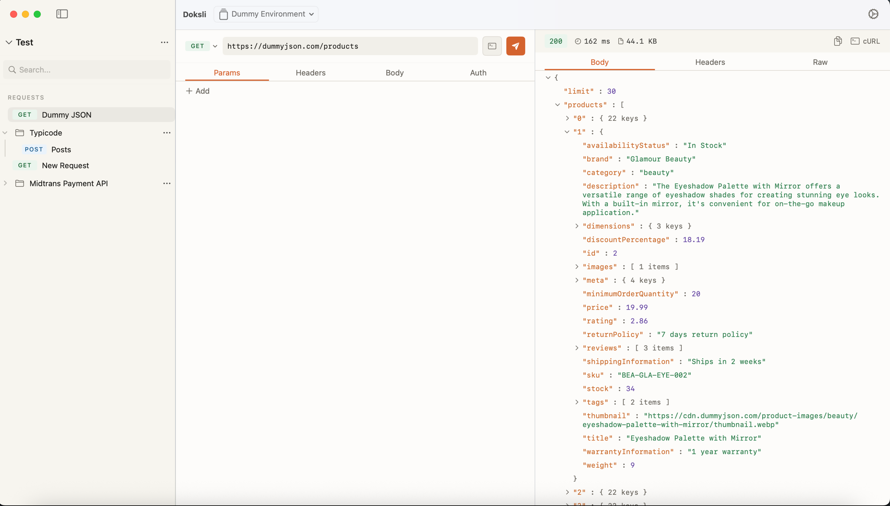
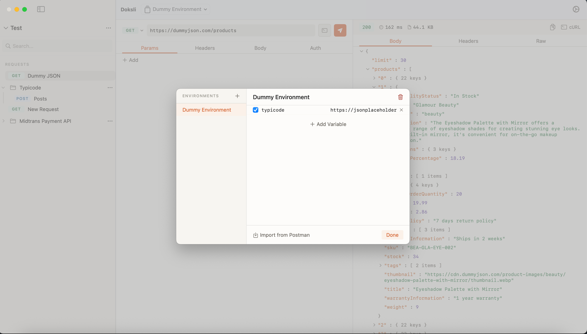
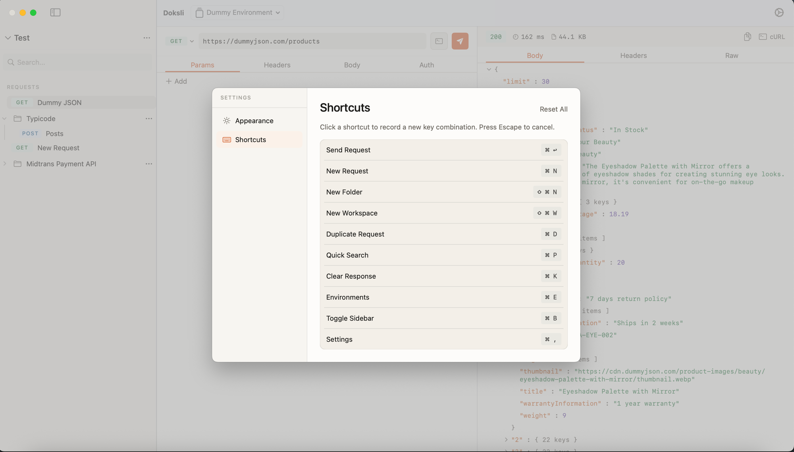
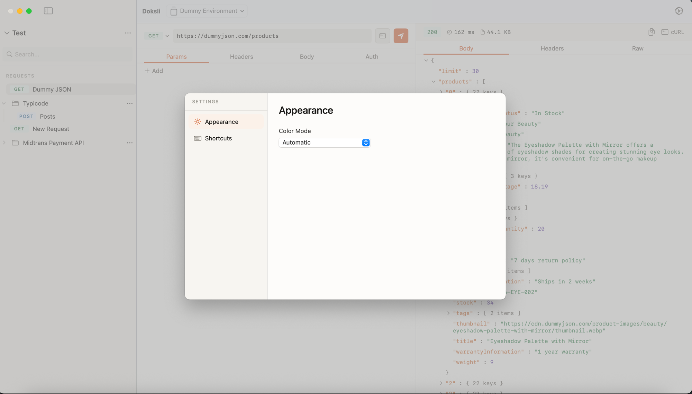

# Doksli

A native macOS API client built entirely with SwiftUI. Zero third-party dependencies — just Foundation and SwiftUI.

## Why Doksli?

Most API clients are Electron apps that consume hundreds of megabytes of RAM to send a GET request. Doksli is a fully native macOS app that launches instantly, uses minimal resources, and feels right at home on your Mac.

## Features

### Request Builder

Compose API requests with a clean, intuitive interface. Supports all standard HTTP methods (GET, POST, PUT, PATCH, DELETE, OPTIONS, HEAD) with color-coded method badges for quick identification.

- **URL bar** with method picker and send button
- **Params** tab for query parameters with enable/disable toggles
- **Headers** tab with key-value editor
- **Body** tab supporting raw JSON, form-data, and URL-encoded formats with syntax validation
- **Auth** tab with Bearer token, Basic auth, and API key modes
- **cURL export** button to copy any request as a cURL command

### JSON Response Viewer

Explore API responses with a syntax-highlighted, collapsible JSON tree viewer. Keys, strings, numbers, booleans, and null values each have distinct colors for easy scanning.

- Expand and collapse objects and arrays at any depth
- Response stats bar showing status code (color-coded: 2xx green, 3xx amber, 4xx/5xx red), duration in ms, and size in KB
- **Body**, **Headers**, and **Raw** response tabs

### Workspaces and Collections

Organize requests into workspaces with folders and collections. The sidebar provides a tree view with drag-and-drop support for rearranging requests between folders.

- Create multiple workspaces
- Nest requests inside folders with unlimited depth
- Context menus for rename, duplicate, and delete
- Fuzzy search across all requests and folders

### Environment Variables

Define variables per environment and reference them in URLs, headers, and body content using `{{variable}}` syntax. Switch between environments (e.g., Development, Staging, Production) from the toolbar.

- Toggle individual variables on/off
- **Import from Postman** — bring your existing Postman environment exports directly into Doksli

### Customizable Keyboard Shortcuts

Every common action has a keyboard shortcut, and they're all customizable from Settings. Click any shortcut to record a new key combination.

| Action | Default |
|---|---|
| Send Request | `Cmd + Return` |
| New Request | `Cmd + N` |
| New Folder | `Shift + Cmd + N` |
| New Workspace | `Shift + Cmd + W` |
| Duplicate Request | `Cmd + D` |
| Quick Search | `Cmd + P` |
| Clear Response | `Cmd + K` |
| Environments | `Cmd + E` |
| Toggle Sidebar | `Cmd + B` |
| Settings | `Cmd + ,` |

### Appearance

Choose between **Automatic** (follows system), **Light**, or **Dark** color mode. The theme uses a warm, Claude-inspired palette with coral-orange accents.

## Requirements

- macOS 13.0 (Ventura) or later

## Building from Source

1. Clone the repository
2. Open `doksli.xcodeproj` in Xcode 15+
3. Build and run (Cmd + R)

No package resolution step needed — there are no dependencies to fetch.

## Tech Stack

| Layer | Technology |
|---|---|
| UI | SwiftUI |
| Navigation | `NavigationSplitView` |
| Networking | `URLSession` async/await |
| Persistence | `JSONEncoder` / `JSONDecoder` |
| Timing | `ContinuousClock` |

## License

All rights reserved.
